# 🏗️ Wellness at Work - System Architecture

## High-Level Architecture Diagram

```mermaid
graph TB
    %% User Layer
    subgraph "👤 User Layer"
        U1[👨‍💻 Desktop User]
        U2[🌐 Web User]
        U3[👥 Admin User]
    end

    %% Client Applications
    subgraph "💻 Client Applications"
        subgraph "🖥️ Desktop App (PyQt6)"
            DA[Desktop Application]
            ET[👁️ Eye Tracker<br/>MediaPipe + OpenCV]
            PM[📊 Performance Monitor<br/>CPU/Memory/Energy]
            LS[💾 Local Storage<br/>SQLite]
            UI[🎨 PyQt6 UI<br/>Light/Dark Theme]
        end
        
        subgraph "🌐 Web Dashboard (Next.js)"
            WD[Web Dashboard]
            WC[📈 Charts & Analytics]
            WL[🔐 Web Login]
            WU[🎨 Modern UI<br/>React Components]
        end
    end

    %% Network Layer
    subgraph "🌐 Network Layer"
        HTTPS[🔒 HTTPS/TLS]
        JWT[🎫 JWT Authentication]
        CORS[🛡️ CORS Protection]
    end

    %% Backend Services
    subgraph "⚡ Backend Services"
        subgraph "🚀 FastAPI Server"
            API[🔌 REST API Endpoints]
            AUTH[🔐 Authentication Service]
            VALID[✅ Data Validation]
            BL[📋 Business Logic]
        end
        
        subgraph "📊 Data Processing"
            SYNC[🔄 Data Sync Engine]
            AGG[📈 Analytics Aggregator]
            BATCH[📦 Batch Processor]
        end
    end

    %% Data Layer
    subgraph "🗄️ Data Layer"
        subgraph "💾 Database (SQLAlchemy)"
            DB[(🗃️ Database<br/>SQLite/PostgreSQL)]
            TBL1[👤 Users Table]
            TBL2[👁️ Blink Samples Table]
            TBL3[📊 Sessions Table]
            TBL4[📋 Tracking Sessions Table]
        end
        
        subgraph "☁️ Cloud Storage (Optional)"
            S3[📁 AWS S3<br/>Backups & Logs]
        end
    end

    %% Infrastructure
    subgraph "🏗️ Infrastructure & Deployment"
        subgraph "🚀 Production Deployment"
            RENDER[🌐 Render.com<br/>Backend Hosting]
            CDN[⚡ CDN<br/>Dashboard Hosting]
        end
        
        subgraph "🔧 Development"
            GH[📚 GitHub Repository]
            CI[🤖 CI/CD Pipeline<br/>GitHub Actions]
            BUILD[🏗️ Build System<br/>PyInstaller + Next.js]
        end
    end

    %% Security & Compliance
    subgraph "🛡️ Security & Compliance"
        GDPR[📋 GDPR Compliance<br/>Data Privacy]
        ENC[🔒 Encryption<br/>Data at Rest & Transit]
        AUDIT[📊 Audit Logging]
    end

    %% Connections - User Interactions
    U1 -.-> DA
    U2 -.-> WD
    U3 -.-> WD

    %% Desktop App Internal Flow
    DA --> ET
    DA --> PM
    DA --> LS
    DA --> UI
    ET -.-> |"Real-time blinks"| UI
    PM -.-> |"CPU/Memory data"| UI
    LS -.-> |"Offline storage"| DA

    %% Network Communications
    DA --> HTTPS
    WD --> HTTPS
    HTTPS --> JWT
    JWT --> API

    %% API Layer
    API --> AUTH
    API --> VALID
    API --> BL
    BL --> SYNC
    BL --> AGG
    BL --> BATCH

    %% Data Flow
    SYNC --> DB
    AGG --> DB
    BATCH --> DB
    
    DB --> TBL1
    DB --> TBL2
    DB --> TBL3
    DB --> TBL4

    %% Cloud Integration
    BATCH -.-> S3
    AUDIT -.-> S3

    %% Development & Deployment
    GH --> CI
    CI --> BUILD
    BUILD --> RENDER
    BUILD --> CDN

    %% Security Integration
    API --> GDPR
    DB --> ENC
    BL --> AUDIT

    %% Styling
    classDef userClass fill:#e1f5fe,stroke:#01579b,stroke-width:2px
    classDef appClass fill:#f3e5f5,stroke:#4a148c,stroke-width:2px
    classDef backendClass fill:#e8f5e8,stroke:#1b5e20,stroke-width:2px
    classDef dataClass fill:#fff3e0,stroke:#e65100,stroke-width:2px
    classDef infraClass fill:#fce4ec,stroke:#880e4f,stroke-width:2px
    classDef securityClass fill:#ffebee,stroke:#b71c1c,stroke-width:2px

    class U1,U2,U3 userClass
    class DA,ET,PM,LS,UI,WD,WC,WL,WU appClass
    class API,AUTH,VALID,BL,SYNC,AGG,BATCH backendClass
    class DB,TBL1,TBL2,TBL3,TBL4,S3 dataClass
    class RENDER,CDN,GH,CI,BUILD infraClass
    class GDPR,ENC,AUDIT,HTTPS,JWT,CORS securityClass
```

## 📋 Component Details

### 🖥️ **Desktop Application (PyQt6)**
- **Eye Tracker**: MediaPipe-based real-time blink detection
- **Performance Monitor**: System resource monitoring (CPU, Memory, Energy)
- **Local Storage**: SQLite for offline data storage
- **UI Layer**: Modern PyQt6 interface with theme switching

### 🌐 **Web Dashboard (Next.js)**
- **Analytics Interface**: Real-time charts and data visualization
- **Authentication**: Secure web login with JWT
- **Responsive Design**: Modern React components with dark theme

### ⚡ **Backend Services (FastAPI)**
- **REST API**: Complete endpoints for data operations
- **Authentication**: JWT-based secure authentication
- **Data Sync**: Batch processing and real-time synchronization
- **Business Logic**: Data validation and processing rules

### 🗄️ **Data Layer**
- **Primary Database**: SQLite (development) / PostgreSQL (production)
- **Schema**: Users, Blink Samples, Sessions, Tracking Sessions
- **Cloud Storage**: AWS S3 for backups and audit logs

### 🛡️ **Security & Compliance**
- **GDPR Compliance**: Privacy-first data handling
- **Encryption**: TLS in transit, encryption at rest
- **Authentication**: JWT tokens with secure validation
- **Audit Logging**: Complete operation tracking

## 🔄 Data Flow

### **Real-time Tracking Flow**
1. **Eye Tracker** detects blinks using MediaPipe
2. **Desktop App** displays real-time counts and metrics
3. **Local Storage** caches data for offline operation
4. **Sync Engine** uploads batches when online
5. **Web Dashboard** displays updated analytics

### **Authentication Flow**
1. User credentials → **Authentication Service**
2. JWT token generation and validation
3. Secure API access with token verification
4. Session management across desktop and web

### **Offline-First Architecture**
1. **Local SQLite** stores all data offline
2. **Sync Engine** detects connectivity
3. **Batch Processor** uploads queued data
4. **Conflict Resolution** handles data merging

## 🚀 Deployment Architecture

### **Production Environment**
- **Backend**: Render.com hosting with auto-scaling
- **Database**: PostgreSQL with automated backups
- **Frontend**: CDN-hosted Next.js application
- **Monitoring**: Real-time health checks and logging

### **Development Workflow**
- **Source Control**: GitHub repository with branching
- **CI/CD**: GitHub Actions for automated testing
- **Build System**: PyInstaller (desktop) + Next.js (web)
- **Distribution**: Cross-platform executable generation

---

## 📊 Key Architectural Decisions

| Decision | Rationale | Trade-offs |
|----------|-----------|------------|
| **PyQt6 Desktop** | Cross-platform native performance | Larger bundle size vs web app |
| **FastAPI Backend** | Modern async Python with auto-docs | Learning curve vs Flask |
| **SQLite + PostgreSQL** | Offline-first with production scalability | Data migration complexity |
| **JWT Authentication** | Stateless, secure, cross-platform | Token management complexity |
| **Offline-First Design** | Reliable operation without connectivity | Sync conflict resolution needed |
| **Component Separation** | Clean architecture, testable, scalable | Initial development overhead |

---

*This architecture supports the complete Wellness at Work eye tracking system with privacy-first design, offline capabilities, and production-ready scalability.*
